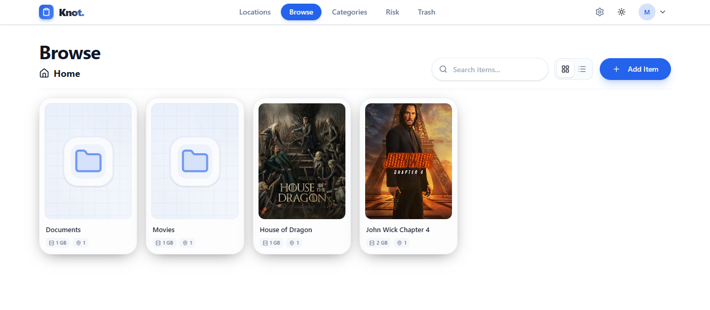

<div align="center">

# 📋Knot

**A personal storage index for your files, drives, backups, and risk visibility.**

[](https://nextjs.org/)
[](https://www.typescriptlang.org/)
[](https://convex.dev/)
[](https://tailwindcss.com/)
[](LICENSE)
[](https://miangee-knot.vercel.app)

[Overview](#overview) · [Tech Stack](#tech-stack) · [Folder Structure](#project-structure-overview) · [Self-Hosting](#production-self-hosting)

</div>



## Overview

**Knot** is a personal storage index built for one purpose: to give people a unified, intelligent view of their digital and physical assets. It helps users understand what exists, where it is stored, how much capacity is being used, and whether important content is at risk of being lost.

From hard drives and cloud accounts to mobile backups and operating-system-managed folders, Knot centralizes inventory management in one professional workspace. It bridges the gap between file organization and storage intelligence without feeling like a heavy enterprise dashboard.

---

## Why Knot

Knot solves a real problem: most people know they own files, but not exactly where they live, how they are protected, or whether they are vulnerable to loss.

| Problem | Knot's Solution |
| --- | --- |
| Files are scattered across folders, drives, and cloud accounts | Centralized storage intelligence with a nested hierarchy |
| No clear backup awareness | Automatic risk detection for single-location files |
| Recovery is difficult after accidental deletion | Soft delete, restore, and hard-delete workflows |
| Storage usage is hard to understand | Capacity tracking with visual bars and health indicators |
| Big collections become hard to browse | Natural sorting, pagination, and multiple view modes |
| Privacy matters | Admin-controlled access and secure auth-backed configuration |

---

## Tech Stack

| Layer | Stack |
| --- | --- |
| Frontend | Next.js 15, App Router, React 18, Tailwind CSS, Shadcn UI |
| State / Forms | Zustand, React Hook Form, Zod |
| Backend | Convex (real-time DB, Auth, file storage, background mutations) |
| Styling | Tailwind CSS |
| Developer Experience | TypeScript, ESLint |

---

## Project Structure Overview

```text
knot/
├── .github/
│   └── hero.png                                 # Hero image used in the README
├── .next/                                       # Local Next.js build output
├── convex/
│   ├── _generated/
│   │   ├── api.d.ts                             # Generated Convex API types
│   │   ├── api.js                               # Generated Convex API client
│   │   ├── dataModel.d.ts                       # Type-safe database model
│   │   ├── server.d.ts                          # Generated server type declarations
│   │   └── server.js                            # Generated server runtime
│   ├── appSettings.ts                           # Admin settings and signup toggle logic
│   ├── auth.config.ts                           # Convex auth provider config
│   ├── auth.ts                                  # Auth actions and signup restrictions
│   ├── categories.ts                            # Category CRUD and data access
│   ├── http.ts                                  # HTTP endpoints / router logic
│   ├── items.ts                                 # Tree structure, sorting, queries, file logic
│   ├── locations.ts                             # Storage location models and logic
│   ├── risk.ts                                  # Risk analysis and risk-based queries
│   ├── schema.ts                                # Main database schema and indexes
│   ├── trash.ts                                 # Soft-delete, restore, hard-delete jobs
│   ├── users.ts                                 # User management logic
│   └── tsconfig.json                            # Convex TypeScript config
├── src/
│   ├── app/
│   │   ├── (auth)/
│   │   │   ├── layout.tsx                       # Shared auth layout
│   │   │   ├── login/
│   │   │   │   └── page.tsx                    # Login screen
│   │   │   └── signup/
│   │   │       └── page.tsx                    # Signup screen
│   │   ├── (dashboard)/
│   │   │   ├── layout.tsx                      # Dashboard shell and layout
│   │   │   ├── admin/
│   │   │   │   └── settings/
│   │   │   │       └── page.tsx                # Admin settings page
│   │   │   ├── browse/
│   │   │   │   └── [[...segments]]/
│   │   │   │       └── page.tsx                # Main browser interface
│   │   │   ├── categories/
│   │   │   │   └── page.tsx                    # Categories management
│   │   │   ├── locations/
│   │   │   │   └── page.tsx                    # Storage locations page
│   │   │   ├── risk/
│   │   │   │   └── page.tsx                    # Risk analysis screen
│   │   │   └── trash/
│   │   │       └── page.tsx                    # Recycle bin UI
│   │   ├── error.tsx                           # Global error boundary
│   │   ├── globals.css                         # Global theme and styling
│   │   ├── layout.tsx                          # Root app shell
│   │   ├── not-found.tsx                       # 404 page
│   │   ├── page.tsx                            # Landing page
│   │   └── providers.tsx                       # App-wide providers
│   ├── features/
│   │   ├── auth/
│   │   │   ├── components/
│   │   │   │   ├── LoginForm.tsx               # Login form UI
│   │   │   │   └── SignupForm.tsx              # Signup form UI
│   │   │   ├── hooks/
│   │   │   │   ├── useAuthActions.ts           # Auth action wrapper
│   │   │   │   ├── useIsAdmin.ts               # Admin access hook
│   │   │   │   └── useSignupEnabled.ts         # Public signup toggle hook
│   │   │   └── types.ts                        # Auth validation and form typings
│   │   ├── categories/
│   │   │   ├── components/
│   │   │   │   ├── CategoryCard.tsx            # Category cards
│   │   │   │   ├── CategoryFormDialog.tsx      # Category form dialog
│   │   │   │   ├── CategoryGrid.tsx            # Category grid
│   │   │   │   └── IconPicker.tsx             # Category icon selector
│   │   │   ├── hooks/
│   │   │   │   └── useCategories.ts            # Categories data hook
│   │   │   └── types.ts                        # Category model types
│   │   ├── items/
│   │   │   ├── components/
│   │   │   │   ├── browser/
│   │   │   │   ├── detail/
│   │   │   │   └── form/
│   │   │   ├── hooks/
│   │   │   │   ├── useBrowseLogic.ts           # Browser state and logic
│   │   │   │   ├── useCreateItem.ts            # Create item mutation logic
│   │   │   │   ├── useDeleteItem.ts            # Delete item logic
│   │   │   │   ├── useItemAncestors.ts         # Breadcrumb traversal logic
│   │   │   │   ├── useItemChildren.ts          # Child-item loading logic
│   │   │   │   ├── useUpdateItem.ts            # Update item mutation logic
│   │   │   │   └── useViewPreference.ts        # Grid/list preference state
│   │   │   ├── utils/
│   │   │   │   └── formatRange.ts              # Range formatting helper
│   │   │   └── types.ts                        # Item model types
│   │   ├── locations/
│   │   │   ├── components/
│   │   │   │   ├── CapacityBar.tsx             # Capacity visual indicator
│   │   │   │   ├── LocationCard.tsx            # Drive/cloud card
│   │   │   │   ├── LocationDeleteModals.tsx   # Delete confirmation UI
│   │   │   │   ├── LocationFormDialog.tsx      # Location form modal
│   │   │   │   ├── LocationGrid.tsx            # Location layout grid
│   │   │   │   ├── LocationHeader.tsx          # Location header controls
│   │   │   │   └── LocationListRow.tsx        # List row presentation
│   │   │   ├── hooks/
│   │   │   │   └── useLocations.ts             # Locations query/mutation logic
│   │   │   ├── utils/
│   │   │   │   └── formatBytes.ts              # Byte formatting helper
│   │   │   └── types.ts                        # Location model types
│   │   ├── risk/
│   │   │   ├── components/
│   │   │   │   └── RiskFilters.tsx             # Risk filter controls
│   │   │   └── hooks/
│   │   │       └── useRiskAnalysis.ts          # Risk engine data hook
│   │   ├── theme/
│   │   │   ├── components/
│   │   │   │   └── ThemeToggle.tsx             # Theme switcher
│   │   │   └── ThemeProvider.tsx               # Theme context provider
│   │   └── trash/
│   │       ├── components/
│   │       │   ├── TrashAssetCards.tsx         # Trashed asset cards
│   │       │   └── TrashContentArea.tsx        # Main trash content UI
│   │       └── hooks/
│   │           └── ...                         # Trash-specific data hooks
│   ├── shared/
│   │   ├── components/
│   │   │   ├── ConfirmDialog.tsx               # Reusable confirmation modal
│   │   │   ├── EmptyState.tsx                  # Empty state UI
│   │   │   ├── navbar.tsx                      # Navbar component
│   │   │   ├── Pagination.tsx                  # Reusable pagination
│   │   │   ├── SearchBar.tsx                   # Search input
│   │   │   └── ui/
│   │   │       └── ...                         # Shadcn/radix UI primitives
│   │   ├── hooks/
│   │   │   └── useDebounce.ts                  # Debounce utility hook
│   │   ├── lib/
│   │   │   └── utils.ts                        # Shared utility functions
│   │   └── store/
│   │       └── useEditMode.ts                  # Edit mode state store
│   └── proxy.ts                                # API proxy / shared request bridge
├── .gitignore                                   # Git ignore rules
├── components.json                              # Shadcn config
├── eslint.config.mjs                            # ESLint configuration
├── LICENSE                                      # MIT license
├── next-env.d.ts                                # Next.js env declarations
├── next.config.ts                               # Next.js config
├── package-lock.json                            # Dependency lock file
├── package.json                                 # Project scripts and dependencies
├── postcss.config.mjs                           # PostCSS config
├── README.md                                    # Project documentation
├── tsconfig.json                                # Root TypeScript config
├── tsconfig.tsbuildinfo                         # TypeScript incremental build info
├── .env.local                                   # Local env file (not committed)
└── .gitignore                                   # Git ignore
```

### Architecture Notes

- **convex/**: The backend foundation of the app, holding schema design, auth flow, database logic, background mutations, and scheduled work.
- **src/app/**: The Next.js App Router layout for authentication, dashboard navigation, and main user-facing screens.
- **src/features/**: A feature-sliced frontend structure where UI, hooks, and types are co-located for maintainability and fast iteration.
- **src/shared/**: Shared components, layout primitives, utilities, and cross-feature state used across the application.

---

## Core Features

### 1. Infinite File & Folder Hierarchy

Knot supports deep nested trees with unlimited folder depth. Files and folders are modeled as a real hierarchical structure so users can represent archives, media libraries, access collections, and organized workspaces without arbitrary limits.

- Recursive folder structure
- Parent-child hierarchy for all content
- Metadata at every item level
- Deep browsing without layout clutter

### 2. Smart Storage Tracking

Each storage location is treated as an asset: hard drive, cloud, mobile device, or OS-managed volume. Capacity and usage are tracked visually so users can understand storage utilization at a glance.

- Track physical and digital storage locations
- Dedicated location types: hard, cloud, mobile, OS
- Capacity monitoring and utilization insights
- Better inventory awareness for long-term management

### 3. Risk Analysis Engine

Knot automatically flags items that exist in only one storage location. This makes it easy to spot data at risk and to prioritize backup and redundancy planning.

- Single-location risk detection
- Reduced backup blind spots
- Clear operational visibility for critical files
- Better storage reliability planning

### 4. Robust Recycle Bin

The recycle bin supports soft delete, restore, and permanent deletion. For large recursive item trees, the project uses Convex background scheduling via `ctx.scheduler.runAfter` to process large deletion and restoration batches without blocking the request or hitting transaction limits.

- Soft delete for items, categories, and locations
- Restore from the bin without data loss
- Hard delete for permanent cleanup
- Background processing for large nested operations

### 5. Natural Lexicographical Sorting

Knot sorts content in a human-friendly way. Folders appear first, and numbers sort naturally, so values like `1, 2, 10, 11` render the expected way instead of alphabetically clumsy order.

This is implemented using hidden zero-padded `sortName` values in the database for efficient, stable ordering.

### 6. Advanced Views & Pagination

The app supports both grid and list views, draggable column sizing, and efficient pagination. State is derived in render instead of being forced into loops, which aligns with React 18 patterns and keeps the interface responsive.

- Grid and list modes
- Adaptive column layouts
- Paginated browsing for large datasets
- Render-stable data flow

### 7. Admin Security

Knot includes Convex Auth and an admin dashboard for controlling signup access. The owner can enable or disable public registration from the settings panel to keep the deployment private when needed.

- Built-in auth with Convex
- Admin-only access control
- Secure, private-first defaults
- Signup policy management in-app

---

## Local Development

### 1) Clone and install

```bash
git clone https://github.com/miangee21/knot
cd knot
npm install
```

### 2) Start the Convex backend

```bash
npx convex dev
```

This starts your local Convex project, creates the backend environment, and wires up the local auth settings automatically. It also configures the development deployment so your app can talk to Convex without manual setup headaches.

Leave this running in one terminal tab while you work.

### 3) Set up Convex Auth

```bash
npx @convex-dev/auth
```

This CLI automatically generates and stores the required auth environment variables for your local Convex deployment, including the JWT signing material and JWKS values. You typically do not need to create these by hand.

### 4) Set the admin email

```bash
npx convex env set ADMIN_EMAIL=your@email.com
```

This gives the matching account access to the admin settings page, where the owner can enable or disable public signups.

### 5) Run the app

In a second terminal:

```bash
npm run dev
```

Then open:

```text
http://localhost:3000
```

---

## Production Self-Hosting

### 1) Deploy the Convex backend

```bash
npx convex deploy
```

This pushes your schema, queries, mutations, and auth configuration to the production Convex environment.

### 2) Configure production auth

```bash
npx @convex-dev/auth --prod
```

This generates the production auth secrets and keys required for secure deployment.

### 3) Set production environment variables

Run the following against your production Convex deployment:

```bash
npx convex env set ADMIN_EMAIL your@email.com --prod
npx convex env set CONVEX_SITE_URL https://your-app.vercel.app --prod
```

Also ensure your frontend has the correct env variables in Vercel:

| Variable | Purpose |
| --- | --- |
| `CONVEX_DEPLOYMENT` | Identifies the active Convex deployment |
| `NEXT_PUBLIC_CONVEX_URL` | Public URL used by the frontend to connect to Convex |
| `CONVEX_SITE_URL` | Required for auth callbacks and redirect flows |
| `ADMIN_EMAIL` | Restricts admin access to the configured owner account |

### 4) Deploy to Vercel

1. Connect the repo to Vercel.
2. Add the environment variables above.
3. Deploy the app.
4. Verify the auth flow, storage dashboard, risk engine, and admin signup controls work correctly in production.

> A secure production setup keeps signups closed by default and only opens them when the admin explicitly decides to.

---

## Project Summary

Knot is a modern personal storage intelligence tool designed for people who want clarity, control, and resilience over their digital ecosystem. It blends the structure of a file manager with the logic of a storage health audit system, helping users track what they own, where it lives, and whether it is protected.

It is built for long-term ownership, secure deployment, and thoughtful operational visibility without sacrificing modern UX or developer experience.

---

## License

This project is licensed under the **MIT License**.

See [LICENSE](LICENSE) for complete terms and conditions.

---

<p align="center">
  Built with care by <a href="https://github.com/miangee21">Muhammad Hassan</a>
</p>
